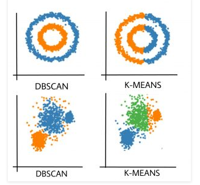
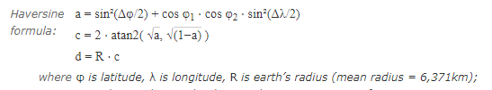
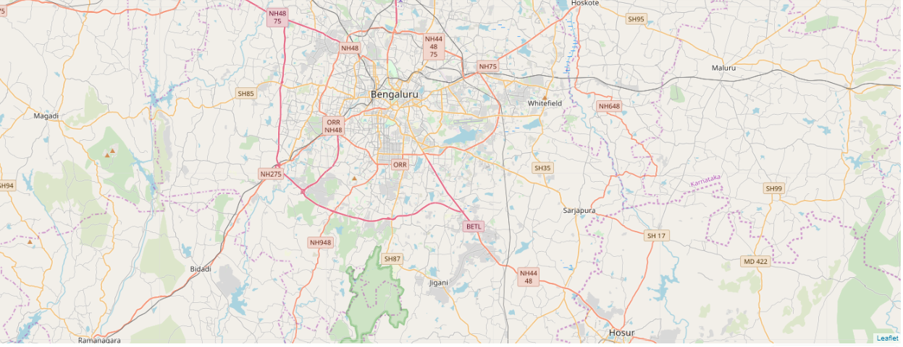
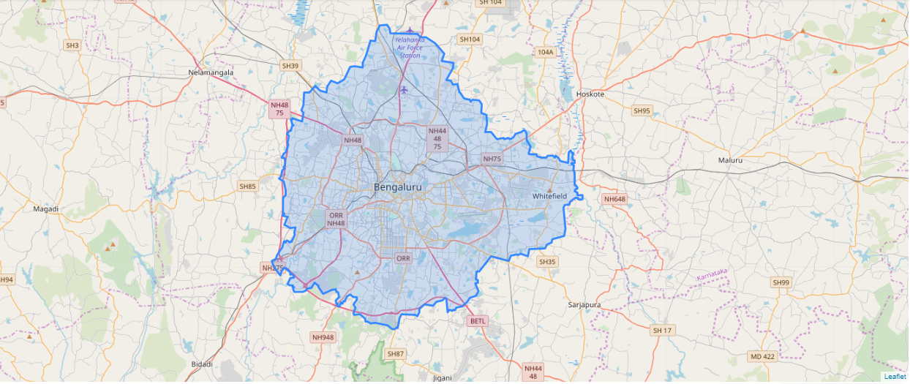
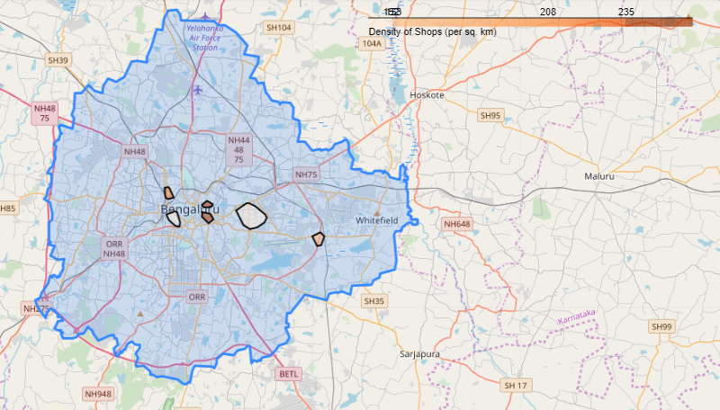
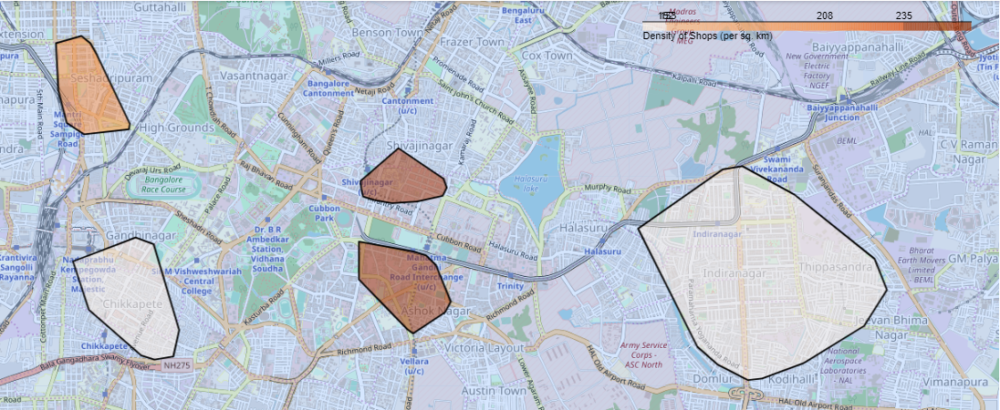
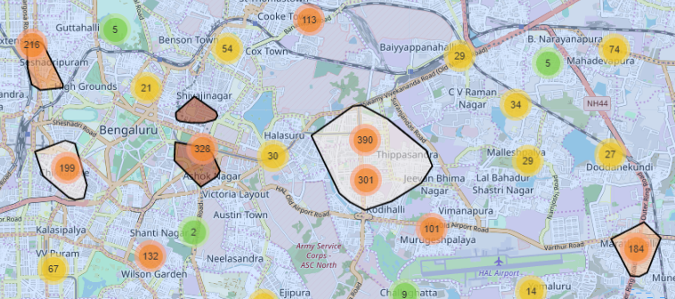

# **Atlan | Data Science Intern | Solution**
## **Tools Used:**
### **1. OpenStreetMap**
The point of interest(POI) data is sources from [OpenStreetMap](https://www.openstreetmap.org/#map=11/12.9895/77.6184). OpenStreetMap (OSM) is a collaborative project to create a free editable map of the world. 
### **2. Overpass Turbo**
It is a web based data mining tool for OpenStreetMap. It runs any kind of [Overpass](https://overpass-turbo.eu) API query and shows the results on an interactive map. The results can be exported in the form of JSON or raw OSM data. Overpy wrapper is used to access the overpass API.
### **3. GeoPandas**
GeoPandas is an open source project to make working with geospatial data in python easier. GeoPandas extends the datatypes used by pandas to allow spatial operations on geometric types. Geometric operations are performed by shapely. Geopandas further depends on fiona for file access and descartes and matplotlib for plotting
### **4. Folium**
It is used visualize data that’s been manipulated in Python on an interactive leaflet map. It enables the binding of data to a map for choropleth visualizations. The library has a number of built-in tileset from OpenStreetMap. It supports GeoJSON overlays.
### **5. Density-based spatial clustering of applications with noise (DBSCAN)**
[DBSCAN](https://www.geeksforgeeks.org/dbscan-clustering-in-ml-density-based-clustering/) is an unsupervised clustering algorithm. It is based on this intuitive notion of “clusters” and “noise”. The key idea is that for each point of a cluster, the neighborhood of a given radius has to contain at least a minimum number of points.

### Why DBSCAN?
Partitioning methods (K-means, PAM clustering) and hierarchical clustering work for finding spherical-shaped clusters or convex clusters. In other words, they are suitable only for compact and well-separated clusters. Moreover, they are also severely affected by the presence of noise and outliers in the data.[(Source)](https://www.geeksforgeeks.org/dbscan-clustering-in-ml-density-based-clustering/)

As distance between any two points on earth’s surface is not the Euclidean distance between their lattitues and longitudes, [Haversine](https://www.movable-type.co.uk/scripts/latlong.html) metric is used for clustering. The haversine formula determines the great-circle distance between two points on a sphere given their longitudes and latitudes (I.e. earth is imagined to be a sphere)

## **Approach**
1. Open the map in notebook using folium.

2. Find and plot the boundaries of Bengaluru using OSM & Overpy.

3. Find the nodes with the entity name 'shop' from OSM using Overpy API.
4. Use DBSCAN with Haversine metric to find out dense clusters from the spatial data of shops. The neighbourhood distance used is 500 mts i.e.  if the distance between two points is lower or equal to ‘eps’ then they are considered as neighbors. Min_samples used is 100.
5. Calculate area of the different clusters and count the total number of shops in each cluster.
6. Find the shops' density (i.e. number of shops per sq. km.) using the produced data.
7. Plot colored polygons on the map representing dense commertial centers/ markets. The color corresponds to the relative shops' density in a cluster.

8. Validation
Using the MarkerCluster class of Folium, clusters of markets are plotted on the map. The results turns out to be similar to the one obtained using DBSCAN.

Intuitively, one of the clusters is centered along MG Road, one of the dense markets of Bengaluru.

